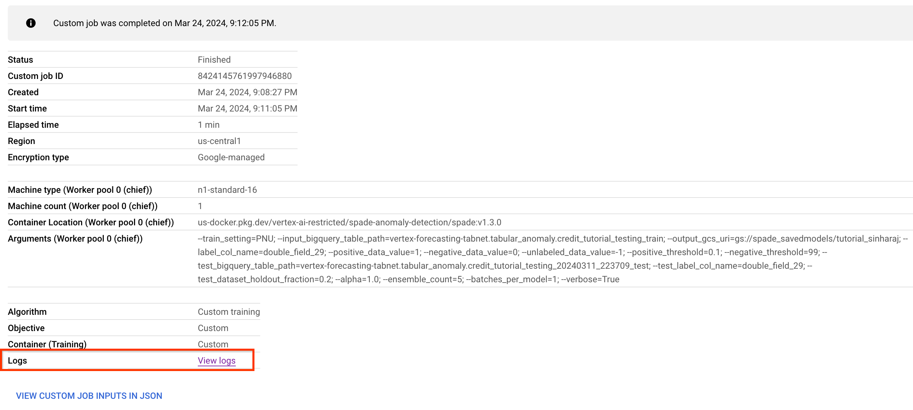
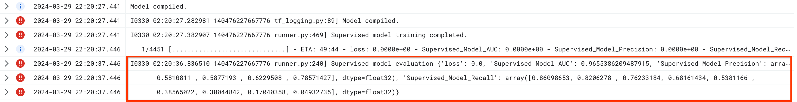

# spade_anomaly_detection

*This is not an officially supported Google product.*

**TMLR Paper**: "SPADE: Semi-supervised Anomaly Detection under Distribution Mismatch", Jinsung Yoon and Kihyuk Sohn and Chun-Liang Li and Sercan O Arik and Tomas Pfister, *Transactions on Machine Learning Research*, ISSN:2835-8856, 2023, [link](https://openreview.net/forum?id=JwDpZSv3yz).

**Google Research Blog Post**: [Link](https://ai.googleblog.com/2023/02/unsupervised-and-semi-supervised.html)

## Introduction

[Semi-supervised Pseudo Labeler Anomaly Detection with Ensembling (SPADE)](https://openreview.net/forum?id=JwDpZSv3yz)  is a semi-supervised anomaly detection method that uses an ensemble of one class classifiers as the pseudo-labelers and supervised classifiers to achieve state of the art results especially on datasets with distribution mismatch between labeled and unlabeled samples. Provided with a min-max scaled dataset, and label values denoting unlabeled, positive, and negative data points located in BigQuery, this custom model trains and uploads TensorFlow saved model assets to a specified GCS location.

## Assumptions

- You have a Google Cloud account and are familiar with the console
- You have a basic understanding of BigQuery, Vertex, and Cloud Storage.
- Machine for Vertex Custom Job will be [`n1-standard-16`](https://cloud.google.com/compute/docs/general-purpose-machines#n1_machines) with a boot disk of `100GB`.

## Input and Output

### Input

**Features**: The algorithm training container expects a BigQuery table whose features are preprocessed in the following way:
Categorical features are one hot encoded.
Continuous features are min-max scaled between 0-1.
Null values are not allowed.

**Label column**: The algorithm training container expects the BigQuery table to have a label column with 3 values - one value for positive anomalies, one value for negative anomalies, and one value for unlabeled anomalies. The values actually used for training and testing will depend on the train setting used - either PU (Positive-Unlabeled) or PNU (Positive-Negative-Unlabeled).

### Output

- A TensorFlow saved model containing the classifier, located in the specified GCS path.
- Logs are written during the training job, and the link can be found by clicking on the train job and navigating to “View Logs”:

  - For detailed logging of the model performance, including number of new pseudo labels added during training, please set verbose=True for training.
  - Note that currently, the logs must be examined to obtain the model performance metrics.

## Metrics

The metric reported by the pipeline is model [AUC](https://developers.google.com/machine-learning/crash-course/classification/roc-and-auc), and [Precision and Recall](https://en.wikipedia.org/wiki/Precision_and_recall) for 9 thresholds from 0.1 to 0.9 in steps of 0.1. These values are displayed in the logs as shown below:

## Setup

1. Create a [GCP project](https://cloud.google.com/resource-manager/docs/creating-managing-projects) if you don't have one yet.
2. Ensure you (or the service account) have [IAM privileges](https://cloud.google.com/iam) to execute training jobs on Vertex and read/write to BigQuery.
  - Write is only required if you have not created a dataset yet.
3. Open a local shell, or use the [Cloud Shell](https://cloud.google.com/shell) located in the GCP console.
4. Create and upload a dataset to [BigQuery](https://cloud.google.com/bigquery) - data will need to be in the format described in the input/output section above.

## SPADE Arguments

**Note: Parameters in red are required, yellow are optional.**

**train_setting (string)**: The 'PNU' (Positive, Negative, and Unlabeled) setting will train the supervised model using ground truth negative and positive data, as well as pseudo-labeled samples from the pseudo-labeler. The 'PU' (Positive and Unlabeled) setting will only use negative data from the pseudo-labeler along with the rest of the positive data (ground truth plus pseudo labeled) to train the supervised model. For model evaluation, we still require ground truth negative data to be in the BigQuery dataset, it just won't be used during training. Default is PNU.

input_bigquery_table_path (string): A BigQuery table path in the format 'project.dataset.table'. If this is the only BigQuery path provided, this will be used in conjunction with the test_dataset_holdout_fraction parameter to create a train/test split.

output_gcs_uri  (string): Cloud Storage location to store the supervised model assets. The location should be in the form gs://bucketname/foldername. A timestamp will be added to the end of the folder so that multiple runs of this won't overwrite previous runs.

label_col_name (string): The name of the label column in the input BigQuery table.

positive_data_value (integer): The value used in the label column to denote positive data - data points that are anomalous. “1” can be used, for example.

negative_data_value  (integer): The value used in the label column to denote negative data - data points that are not anomalous. “0” can be used, for example.

unlabeled_data_value  (integer): The value used in the label column to denote unlabeled data. “-1” can be used, for example.

positive_threshold: Float between [0, 100] used as the percentile for the one class classifier ensemble to label a point as positive. The closer to 0 this value is set, the less positive data will be labeled. However, we expect an increase in precision when lowering the value, and an increase in recall when raising it. Equivalent to saying the given data point needs to be located in X percentile or lower in order to be considered anomalous.
 If we have the prior knowledge of the anomaly ratio of the dataset (denoted as gamma), we set this value as 100*gamma. If we do not have the prior knowledge of gamma, we estimate this gamma value using the given labeled data and set it as 100*gamma_estimate.

negative_threshold: Float between [0, 100] used as the percentile for the
one class classifier ensemble to label a point as negative. The higher this value is set, the less negative data will be labeled.We expect an increase in precision when raising this value, and an increase in recall when lowering it. Equivalent to saying the given data point needs to be X percentile or greater in order to be considered normal.
 If we have the prior knowledge of the anomaly ratio of the dataset (denoted as gamma), we set this value as 100*(1-gamma). If we do not have the prior knowledge of gamma, we estimate this gamma value using the given labeled data and set it as 100*(1-gamma_estimate).

test_bigquery_table_path: A complete BigQuery path in the form of  'project.dataset.table' to be used for evaluating the supervised model. Note that the positive and negative label values must also be the same in this testing set. It is okay to have your test labels in that form, or use 1 for positive and 0 for negative. Unlabeled data in this table is ignored for evaluation purposes. If this value is not provided, then test_dataset_holdout_fraction is used instead.

test_label_col_name: The label column name in the test dataset. Required if setting the test_bigquery_table_path parameter.

test_dataset_holdout_fraction: This setting is used if test_bigquery_table_path is not provided. Float between 0 and 1 representing the fraction of samples to hold out as a test set. Default is 0.2, meaning 20% of the data is used for training. In the PU setting, this means that 20% of the positive labels and 100% of the negative data (Since we do not use any ground truth negative data for the supervised mode training) will be used for creating the test sets. For the PNU setting, it is just 20% of positive and negative samples, sampled uniformly at random, all other data would be used for training.

alpha (float): Sample weights for weighting the loss function, only for pseudo-labeled data from the occ ensemble. Original data that is labeled will have a weight of 1.0. By default, we use alpha = 1.0.

ensemble_count: Integer representing the number of one class classifiers in the ensemble used for pseudo labeling unlabeled data points. The more models in the ensemble, the less likely it is for all the models to gain consensus, and thus will reduce the amount of labeled data points. By default, we use 5 one class classifiers.

verbose (boolean): The amount of console logs to display during training. Use the default value of  False to show fewer messages, and True for displaying many aspects of model training and scoring. This is useful for debugging model performance.

## Training Job Arguments

The [gcloud custom jobs documentation](https://cloud.google.com/sdk/gcloud/reference/ai/custom-jobs/create) describes these (and other arguments) in detail and the following gives a brief description of the most important attributes.

region: The GCP region to run the job in (e.g. us-central1).

project: The GCP project used for running the job.

display-name: The name that will be used for the training job. Note that it is easiest to keep track of the results if this is unique but it does not have to be.

worker-pool-spec: A comma delimited list of machine configuration information.

## Example Notebooks

Notebooks where you can plug in your parameters and run the custom training job. The notebooks just require a Google account and Cloud Project.

**(TODO(b/333154677): Add OSS version of Notebook)**

## Example Shell Scripts

**Note: See the example notebooks for the most up to date full list of parameters.**

### Script to Build SPADE Container

~~~
# Run this from your base directory. For example, run
# ./spade/scripts/build_and_push.sh from your home directory.

set -x

IMAGE_TAG=${1:-"latest"}
IMAGE_NAME=${2:-"spade"}
PROJECT_ID=${3:-"[project_id]"}
REPO_NAME=${5:-"spade"}
IMAGE_BASE_URI=${4:-"us-docker.pkg.dev"}

# Image for team testing.
IMAGE_URI_ML="${IMAGE_BASE_URI}/${PROJECT_ID}/${REPO_NAME}/${IMAGE_NAME}:${IMAGE_TAG}"

BUILD_IMAGE="true"

if "${BUILD_IMAGE}"; then
  DOCKER_BUILDKIT=1 docker build -f ./spade/Dockerfile -t "${IMAGE_URI_ML}" .
fi

docker push "${IMAGE_URI_ML}"

echo "Built and pushed ${IMAGE_URI_ML}"
~~~

### Script to launch SPADE training from an already pushed container

~~~
set -x

PROJECT_ID=${1:-"project_id"}
#Args, maintain same order as runner.run and task.py.
TRAIN_SETTING=${15:-"PNU"}

TRIAL_NAME="prod_spade_credit_${TRAIN_SETTING}_${USER}"

INPUT_BIGQUERY_TABLE_PATH=${2:-"bq_table_path"}
OUTPUT_GCS_URI=${14:-"gs://[your-gcs-bucket]/models/model_experiment_$(date '+%Y%m%d_%H%M%S')"}
LABEL_COL_NAME=${3:-"y"}
# The label column is of type float, these must match in order for array
# filtering to work correctly.
POSITIVE_DATA_VALUE=${4:-"1"}
NEGATIVE_DATA_VALUE=${5:-"0"}
UNLABELED_DATA_VALUE=${6:-"-1"}
POSITIVE_THRESHOLD=${7:-".1"}
NEGATIVE_THRESHOLD=${8:-"95"}
TEST_BIGQUERY_TABLE_PATH=${16:-"table_path"}
TEST_LABEL_COL_NAME=${17:-"y"}
ALPHA=${10:-"1.0"}
ENSEMBLE_COUNT=${12:-"5"}
VERBOSE=${13:-"True"}

PROD_IMAGE_URI="us-docker.pkg.dev/[project_id]/spade-anomaly-detection/spade:latest"

REGION="us-central1"

# Give a unique name to your training job.
DATE="$(date '+%Y%m%d_%H%M%S')"
WORKER_MACHINE="machine-type=n1-standard-16"

gcloud ai custom-jobs create \
 --region="${REGION}" \
 --project="${PROJECT_ID}" \
 --display-name="${TRIAL_NAME}" \
 --worker-pool-spec="${WORKER_MACHINE}",replica-count=1,container-image-uri="${PROD_IMAGE_URI}" \
 --args=--train_setting="${TRAIN_SETTING}" \
 --args=--input_bigquery_table_path="${INPUT_BIGQUERY_TABLE_PATH}" \
 --args=--output_gcs_uri="${OUTPUT_GCS_URI}" \
 --args=--label_col_name="${LABEL_COL_NAME}" \
 --args=--positive_data_value="${POSITIVE_DATA_VALUE}" \
 --args=--negative_data_value="${NEGATIVE_DATA_VALUE}" \
 --args=--unlabeled_data_value="${UNLABELED_DATA_VALUE}" \
 --args=--positive_threshold="${POSITIVE_THRESHOLD}" \
 --args=--negative_threshold="${NEGATIVE_THRESHOLD}" \
 --args=--test_bigquery_table_path="${TEST_BIGQUERY_TABLE_PATH}" \
 --args=--test_label_col_name="${TEST_LABEL_COL_NAME}" \
 --args=--alpha="${ALPHA}" \
 --args=--ensemble_count="${ENSEMBLE_COUNT}" \
 --args=--verbose="${VERBOSE}"
~~~

## Example Datasets and their Licenses

Datasets in `example_data/*` are made available under the [CC BY 4.0 License](https://creativecommons.org/licenses/by/4.0/legalcode.txt). See the README file in that
folder for details.
